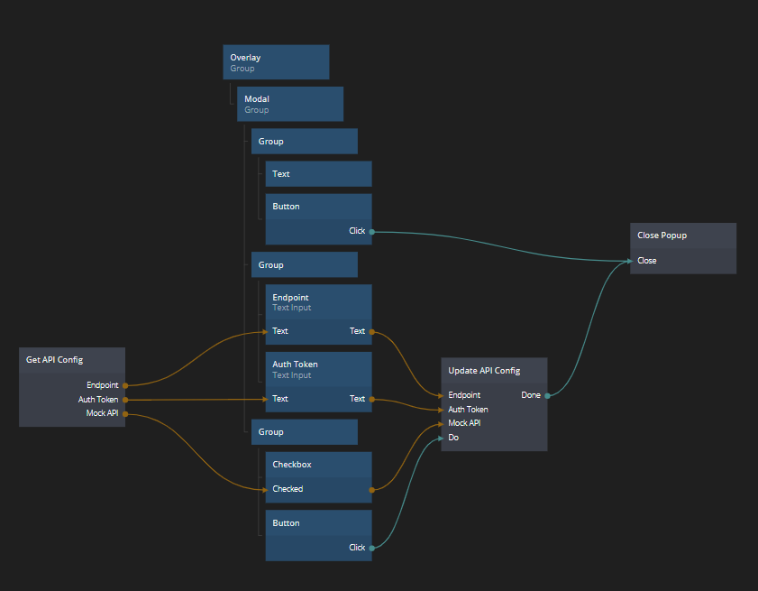

# Reactive Object Nodes
Nodes that automatically update the outputs.

In this case I am saving configs globally in Javascript.



Config:
```ts
import * as Noodl from '@noodl/noodl-sdk'

class Lazy<T> {
    activator: () => T;
    instance: T | undefined;

    constructor(activator: () => T) {
        this.activator = activator;
    }

    get(): T {
        if (!this.instance) {
            this.instance = this.activator();
        }

        return this.instance;
    }
}

type Config = {
    endpoint: string;
    authToken: string;
    mockApi: boolean;
}

const config: Lazy<Noodl.Object<Config>> = new Lazy(() => 
    Noodl.Object.create<Config>({
        endpoint: 'http://localhost:3000',
        authToken: '',
        mockApi: true
    })
)

export { config }
```

get-config:
```ts
import * as Noodl from '@noodl/noodl-sdk'
import { config } from '../../config'

const node = Noodl.defineNode({
    category: 'Noodl Hosting Admin API',
    name: 'Get API Config',
    color: 'data',
    initialize: function () {
        const _this = this;
        const update = () => {
            const instance = config.get();
            _this.setOutputs({
                endpoint: instance.get('endpoint'),
                authToken: instance.get('authToken'),
                mockApi: instance.get('mockApi')
            })
        }

        const instance = config.get();
        // TODO: Call 'off' on destroy,
        //       would be nice to have a defined life cycle of the nodes.
        instance.on('change', update)
        
        update()
    },
    outputs: {
        endpoint: {
            group: 'Config',
            displayName: 'Endpoint',
            type: 'string'
        },
        authToken: {
            group: 'Config',
            displayName: 'Auth Token',
            type: 'string'
        },
        mockApi: {
            group: 'Config',
            displayName: 'Mock API',
            type: 'boolean'
        },
    }
});

export const module = {
    node
}
```

update-config:
```ts
import * as Noodl from '@noodl/noodl-sdk'
import { config } from '../../config'

const node = Noodl.defineNode({
    category: 'Noodl Hosting Admin API',
    name: 'Update API Config',
    color: 'data',
    inputs: {
        endpoint: {
            group: 'Config',
            displayName: 'Endpoint',
            type: 'string'
        },
        authToken: {
            group: 'Config',
            displayName: 'Auth Token',
            type: 'string'
        },
        mockApi: {
            group: 'Config',
            displayName: 'Mock API',
            type: 'boolean'
        },
    },
    outputs: {
        done: {
            group: 'Events',
            displayName: 'Done',
            type: 'signal'
        }
    },
    signals: {
        Do() {
            const instance = config.get();
            instance.setAll({
                endpoint: this.inputs.endpoint,
                authToken: this.inputs.authToken,
                mockApi: !!this.inputs.mockApi
            })

            this.sendSignalOnOutput('done')
        }
    }
});

export const module = {
    node
}
```
